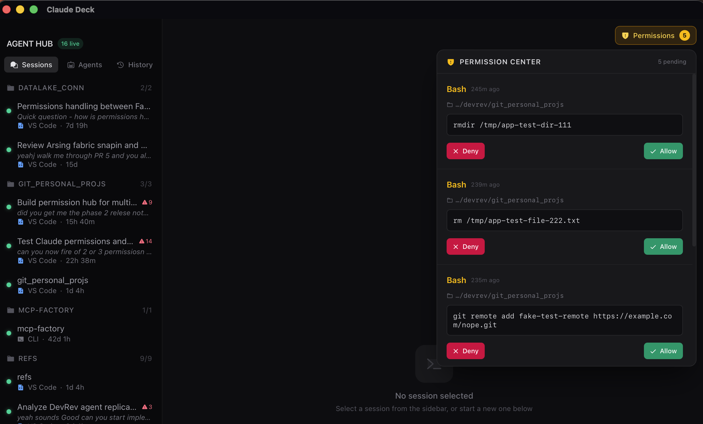
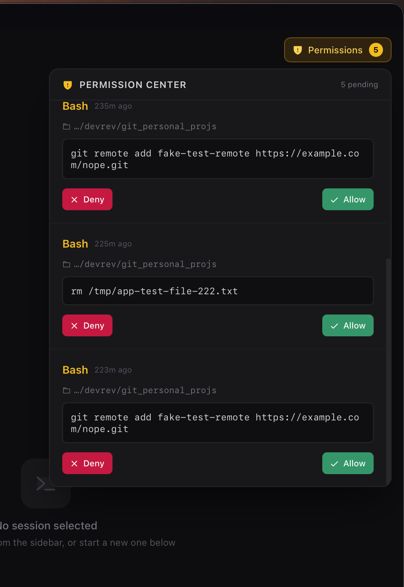

# Claude Deck

> **One window for every Claude Code session on your machine — and one place to approve what they're all about to do.**

[](LICENSE)
[](https://tauri.app)
[](package.json)
[](src-tauri/Cargo.toml)
[](#status)

Claude Deck discovers every Claude Code session running on your Mac — in Cursor, VS Code, or a bare terminal — and shows them in one live dashboard. Its centerpiece is the **Permission Hub**: when *any* of those sessions is about to run a command, edit a file, or hit the network, the request is routed into a single approval queue instead of a prompt buried in whichever terminal spawned it.

---

## The Permission Hub

<p align="center">
  
</p>

Run five Claude sessions in parallel and the permission prompts become the bottleneck — each one blocks *its* terminal, and you're alt-tabbing across windows to find the one that's waiting on you. Claude Deck collapses all of them into a single queue:

- **Every session, one queue.** Sessions spawned anywhere on the machine surface here — not just ones Claude Deck started.
- **Enough context to actually decide.** Each request shows the tool, the exact command or file, the working directory, and which session it came from.
- **It defers to *your* rules.** Claude Deck reads your own `~/.claude/settings.json` allow/deny/ask policy and only asks about the things you haven't already decided. It's an aid, not a hijacker — anything outside its policy falls straight back to Claude's native prompt.
- **It never leaves a session hanging.** Requests you ignore auto-expire with a visible countdown, and if the app isn't reachable the hook fails through to Claude's normal flow in milliseconds — never a multi-minute freeze.

<p align="center">
  
</p>

Alongside the hub, the sidebar is a live map of everything running: sessions grouped by project, model / token / uptime metadata pulled from disk, health polling, and status dots — plus the ability to spawn new hub-native sessions of your own.

---

## How it works

The whole thing hangs on one property of Claude Code:

> **Claude Code hot-reloads `~/.claude/settings.json`.** Register a hook there and it applies to *every* session on the machine, immediately — including ones you didn't start.

So Claude Deck registers a **`command` hook**: a note that says "run this small program before any tool." That program (`claude-deck-hook`) is stateless — it starts fresh each call, hands the request to the app over a **private local socket**, waits for your verdict, prints it back, and exits.

```
  Claude Code            claude-deck-hook            Claude Deck
  (any session)          (fresh process/call)        (the app)
      │                        │                         │
      │  tool about to run     │                         │
      ├───────  stdin  ───────►│                         │
      │                        │   unix domain socket    │
      │                        ├────────────────────────►│  ┌─────────────┐
      │                        │                         │  │  your call: │
      │                        │                         │  │ Allow / Deny│
      │                        │◄────────────────────────┤  └─────────────┘
      │◄──────  stdout  ───────┤   {allow | deny | ask}  │
      │  decision enforced     │                         │
```

Why a *program over a socket* rather than the more obvious "point Claude at a web server"? That choice is the difference between a hub that quietly poisons every session on the machine when it crashes, and one that fails safe in ~12ms. The reasoning — and the rest of the design — is written up in [`docs/shipped-notes/`](docs/shipped-notes/).

---

## Setup

### Prerequisites

- macOS (Apple Silicon or Intel)
- [Rust stable](https://rustup.rs/) (`rustup default stable`)
- Node 20+ and npm
- Xcode Command Line Tools (`xcode-select --install`)
- Claude Code CLI installed (`npm install -g @anthropic-ai/claude-code`, or your channel of choice)

### Install & run

```bash
npm install

# Dev mode with hot reload
npm run tauri dev

# Production build (.app + .dmg in src-tauri/target/release/bundle/)
npm run tauri build

# Rust-only check (faster than a full build)
cargo check --manifest-path src-tauri/Cargo.toml
```

On launch, Claude Deck writes exactly one `claude-deck` hook into your `settings.json` and removes it on a clean quit. Your own hooks are left untouched.

> The working tree on disk is still named `agent-hub/` and the crate is `agent-hub` — renaming mid-stream would invalidate `target/` for no benefit. The shipping product, bundle identifier, and app are all **Claude Deck**.

---

## Tech stack

| Layer | Tools |
|---|---|
| Desktop shell | Tauri 2 (Rust binary + WKWebView) |
| Backend | Rust stable, tokio, axum, serde, uuid |
| Frontend | React 19, TypeScript 5.7, Tailwind CSS 4, Zustand 5, Framer Motion |
| Build | Vite 6, `@tauri-apps/cli` 2 |
| Hook bridge | Standalone `claude-deck-hook` binary ↔ app over a unix domain socket |
| Icons | @phosphor-icons/react |

---

## Status

Actively developed. Shipped and in daily use:

- **Session discovery + live dashboard** — scans `~/.claude` on disk, surfaces every session regardless of which client spawned it, with project grouping, health polling, and metadata enrichment.
- **Permission Hub** — the command-bridge hook, the central approval queue, a policy engine that honors your own `settings.json`, fail-to-native safety, and auto-expiry of stale requests.

Open work is tracked in [GitHub Issues](../../issues) and the phase tracker at [`docs/PHASES.md`](docs/PHASES.md). A screen recording of the hub in action is coming — see [`docs/CAPTURE_CHECKLIST.md`](docs/CAPTURE_CHECKLIST.md).

<!-- TODO(demo): embed screen recording here — docs/demo.gif or a hosted video link -->

---

## Contributing

Contributions are welcome — the issue tracker has a set of scoped, labeled tasks, including [`good first issue`](../../issues?q=is%3Aissue+is%3Aopen+label%3A%22good+first+issue%22)s to get started with. See **[CONTRIBUTING.md](CONTRIBUTING.md)** for setup, branch/PR conventions, and how to claim an issue.

Deeper technical context lives in [CLAUDE.md](CLAUDE.md) and [`docs/shipped-notes/`](docs/shipped-notes/).

---

## License

Apache License 2.0 — see [LICENSE](LICENSE).
